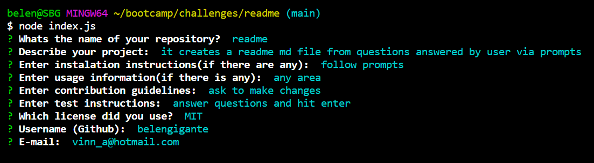

# README Generator

# Description

This project is a readme.md file created from prompts answered by the user, it is intended to run on node. it contains questions to fill out a title, description of the project, instalation, usage, license, contributions, tests and contact information for questions.
When all the questions are answered the program will automatically create a table of contents linking the list items to their beloging sections, a badge corresponding the license will appear at the top of the screen, when clicked it will take the user to a website with information about that license, if the user doesnt select a license from the menu the badge when clicked will direct the user to a website with recomended licenses.
At the end of the readme functional github and email links will be generated for contact and questions.
Node modules, json packages and gitignore were created same as npm dependencies.

This readme file will be replaced by your generated README.md.

## Instructions

* Refer to the [Readme demostration video](./assets/video/readme%20generator.webm) for instructions.

## Visuals

## Links

[github repository link ](https://github.com/BelenGigante/readme.git)